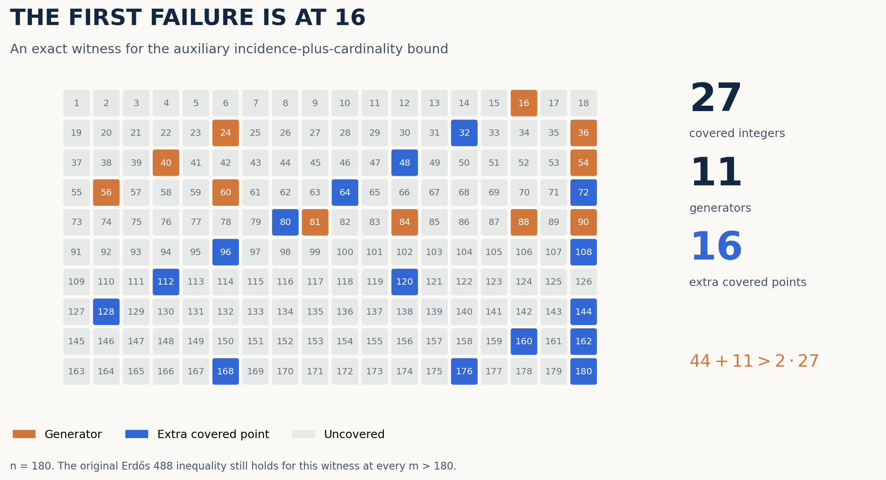
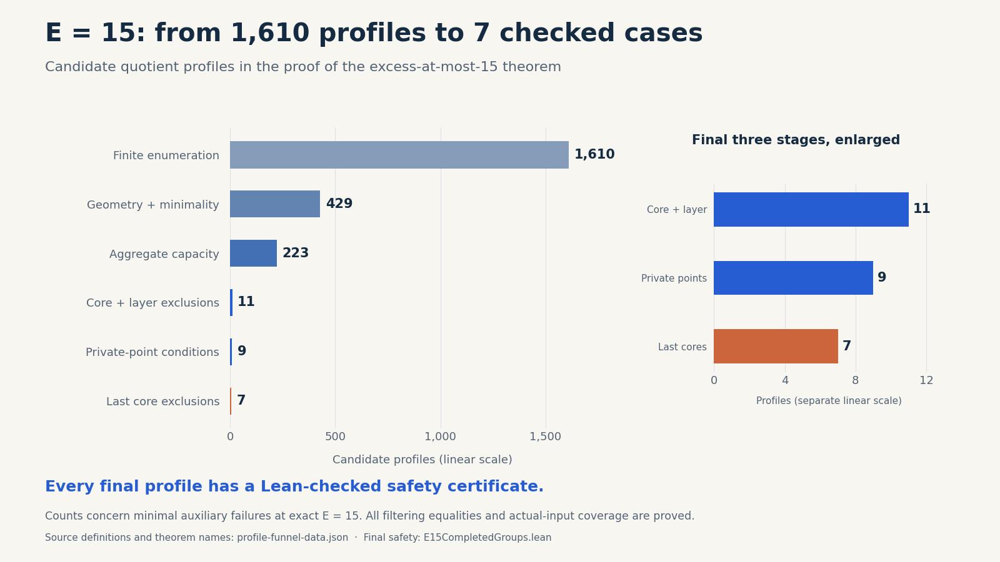
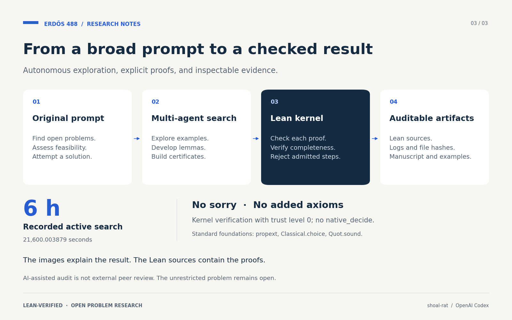

# Beyond the Slack Barrier

**Lean-verified bounds and counterexamples around Erdős problem 488.**

[Read the paper](paper/paper.pdf) · [中文论文](paper/paper.zh.pdf) · [Lean theorems](#proved-results) · [Reproduce](#reproduce-the-proofs) · [中文首页](README.zh-CN.md)

An auxiliary estimate works for every primitive generator set through excess **15**, and its first possible failure is exactly **16**. We prove that boundary, construct failures that remain arbitrarily sparse and collectively coprime, and establish verified cases of the original density inequality. The proofs are checked by Lean's kernel.



*The figure shows a failure of the auxiliary estimate. The original Erdős inequality still holds for this example.* [Exact Lean witness](research/SmallSlack.lean) · [Figure data](paper/figures/witness-data.json)

## The mathematics

A finite set of positive integers is **primitive** if no distinct element divides another. For a finite primitive set $`G\subseteq\{2,\ldots,n\}`$, define

```math
F_G(n)=\#\{1\le u\le n:\exists g\in G,\ g\mid u\},
\qquad
I_G(n)=\sum_{g\in G}\left\lfloor\frac ng\right\rfloor.
```


The **excess** $`E_G(n)=F_G(n)-|G|`$ counts covered integers beyond the generators themselves. The original inequality asks, for nonempty $`G`$ and every integer $`m>n`$, whether

```math
nF_G(m)<2mF_G(n).
```


The auxiliary estimate $`I_G(n)+|G|\le2F_G(n)`$ is sufficient to establish this inequality. Our results locate its exact first failure and explain why stronger tools are needed beyond it.

## Proved results

| Result | What is proved | Lean entry point |
| --- | --- | --- |
| **Original inequality through excess 15** | Every nonempty primitive $`G\subseteq\{2,\ldots,n\}`$ with $`E_G(n)\le15`$ satisfies the original strict inequality for every $`m>n`$. The auxiliary estimate also holds throughout this range. | [ExcessFifteenMain.lean](research/ExcessFifteenMain.lean) |
| **Sharp auxiliary threshold: 16** | The least excess permitting an auxiliary failure is exactly 16. This remains true with collective coprimality, arbitrarily small covered density, and arbitrarily large lower endpoints. The constructed sharp family still satisfies the original inequality. | [SharpSlackThreshold.lean](research/SharpSlackThreshold.lean), [SharpSparseLeast.lean](research/SharpSparseLeast.lean), [SharpSparseOriginal.lean](research/SharpSparseOriginal.lean) |
| **Two auxiliary conjectures refuted** | Explicit finite counterexamples refute the pair-versus-tail assertion and the sparse order-slack assertion—Conjectures 4.8 and 6.11 in the specified 20 March 2026 manuscript. | [ProofsSmall.lean](research/ProofsSmall.lean), [ProofsCore.lean](research/ProofsCore.lean) |
| **Unbounded pair-tail density ratios** | For every fixed $`2\le a<b`$ with $`a\nmid b`$, a suitable finite prime tail makes the later-to-earlier surviving-density ratio exceed any prescribed factor. The tail and endpoints may vary. | [GeneralPairTail.lean](research/GeneralPairTail.lean) |
| **Unbounded auxiliary failures** | Incidence-to-coverage ratios are unbounded even with simultaneous primitivity, collective coprimality, arbitrary sparsity, and arbitrarily large endpoints. Separate constructions realize every additive defect $`L\ge2`$. | [UnboundedSlackRatio.lean](research/UnboundedSlackRatio.lean), [UnboundedSlackDefect.lean](research/UnboundedSlackDefect.lean) |

Here **collectively coprime** means $`\gcd(G)=1`$; it does not require pairwise coprimality. The full hypotheses, quantifiers, and theorem names appear in the [paper](paper/paper.pdf) and linked Lean sources.

<!-- BEGIN E16 STATUS: v0.1 retains the excess-at-most-fifteen release scope. -->
**Release scope: excess at most 15.** The E16 original-inequality theorem and its primitive-core wrappers have now passed local recompilation and an independent integration audit. They are reserved for a separate next release; the v0.1 theorem list and reproduction manifest retain the accepted E≤15 snapshot.
<!-- END E16 STATUS -->

The unrestricted Erdős problem remains unresolved in this project. Auxiliary counterexamples do not refute the original inequality. Formal verification establishes the displayed statements; global historical priority for all strengthened formulations is not claimed.

## The first auxiliary failure, explicitly

Take

```math
G=\{16,24,36,40,54,56,60,81,84,88,90\},\qquad n=180.
```


Lean verifies that $`G`$ is primitive, $`\gcd(G)=1`$, and

```math
|G|=11,\quad F_G(180)=27,\quad I_G(180)=44,\quad E_G(180)=16.
```


Thus $`2F_G(180)=54<180`$, while $`I_G(180)+|G|=55>54`$. The failure is only one unit, and the threshold theorem excludes every smaller excess. [Witness and exact counts](research/SmallSlack.lean) · [Least-excess theorem](research/SharpSlackThreshold.lean)

## The proof classification, in one chart



The bars count candidate quotient profiles for a minimal auxiliary failure at exact excess 15. Each final profile has a checked safety certificate; the complete reduction and those certificates establish the universal theorem. The enlarged panel has its own explicitly labelled linear scale.

[Exact data, source definitions, and theorem names](paper/figures/profile-funnel-data.json) · [Rebuild the chart](scripts/build_profile_funnel.py) · [Final safety theorem](research/E15CompletedGroups.lean)

## Reproduce the proofs

The project uses **Lean 4.33.1** and **Mathlib commit `0df444a360eaa60ab8c11dca51a86af692955474`**. Install the toolchain identified in `lean-toolchain`, then choose a verification scope from the project root.

**Quick finite checks — no Mathlib required:**

```bash
python3 scripts/verify_core.py
```

This rebuilds `ProofsCore`, `ProofsSmall`, and `Scaling` with trust level zero in an isolated local workspace, preserving the published verification records. It verifies the small core examples and scaling results; it does not rebuild the complete threshold theorem.

**Full source verification — use a fresh checkout or extraction:**

```bash
lake update
lake exe cache get
python3 research/verify_bundle.py --mathlib-root .lake/packages/mathlib
```

The full verifier first checks the release's `MANIFEST.json`, confirms the pinned Lean and Mathlib versions, and rebuilds every listed Lean source in dependency order using `-j 1 -t 0`. It records actual exit codes and stops at a failed check. A complete rebuild includes substantial finite certificates and can take considerable time.

To inspect the manifest and build order without invoking Lean:

```bash
python3 research/verify_bundle.py --dry-run
```

See [reproduction details](research/REPRODUCE.md). The accepted proofs use no `sorry`, `admit`, `native_decide`, or added axioms. Reported classical dependencies are drawn from `propext`, `Classical.choice`, and `Quot.sound`.

## What the certificates establish

Search programs generate candidate finite tables. Lean proves the reductions that make those tables complete and checks the relevant transitions, coverage, and final conclusions. The generators are outside the mathematical trust boundary.

The positive result combines quotient-profile bounds, finite capacity checks, small-core exclusions, normalized graph certificates, and a bridge back to the original inequality. Checking a final module against existing compiled imports and rebuilding its entire dependency graph are distinct operations; the verification records identify their actual scope. Interrupted, rejected, and superseded attempts are not accepted proofs.

## Started from one broad research prompt



The project began with a user asking an AI agent to survey mathematical opportunities, undertake at least six hours of research, and deliver a Lean-verified result. Read the [original Chinese prompt and its English translation](docs/INITIAL-PROMPT.md).

An OpenAI Codex multi-agent workflow carried out mathematical exploration, finite searches, Lean implementation, certificate generation, integration, and selected independent agent audits. The user subsequently requested continuation and directed the publication work. This was an extended collaborative session; the original prompt was not its only human input.

The paper documents the workflow and recorded search duration. AI-agent review is distinct from external human peer review. This repository makes no claim of journal acceptance or institutional endorsement.

## Paper, sources, and attribution

- **Paper:** [English PDF](paper/paper.pdf), [中文 PDF](paper/paper.zh.pdf), [English Markdown](paper/paper.md), [中文 Markdown](paper/paper.zh.md), [LaTeX](paper/paper.tex), [bibliography](paper/refs.bib).
- **Problem specification:** [versioned Erdős 488 statement](https://github.com/google-deepmind/formal-conjectures/blob/8323e878b83fcd7f4a448256069352a265460d75/FormalConjectures/ErdosProblems/488.lean).
- **Auxiliary conjectures:** Przemysław Chojecki, [*Signed Transport, Pair–Tail Reduction, and Low Layers in an Erdős Density-Doubling Problem*](https://www.ulam.ai/research/erdos488.pdf), version dated 20 March 2026. The paper records the inspected PDF's hash so that conjecture numbering has a fixed referent.
- **Publication design:** [primary-source review of AI mathematics releases](research/ai-math-release-patterns.md).

Classical ingredients—including prime-reciprocal divergence, the union bound, and scaling—are credited as established mathematics. The project curator is `shoal-rat`; no personal author identity is inferred from that handle. Cite the exact artifact version and theorem when discussing a result.
